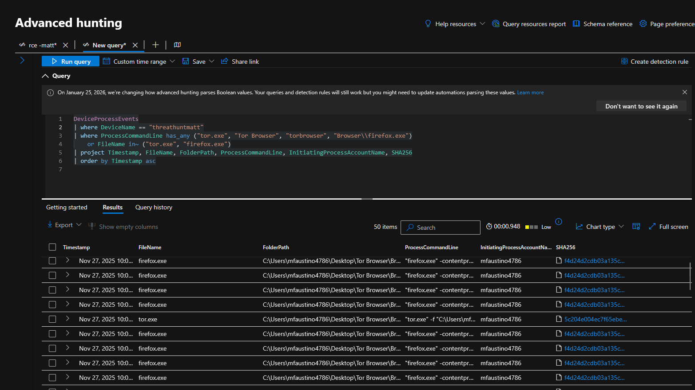
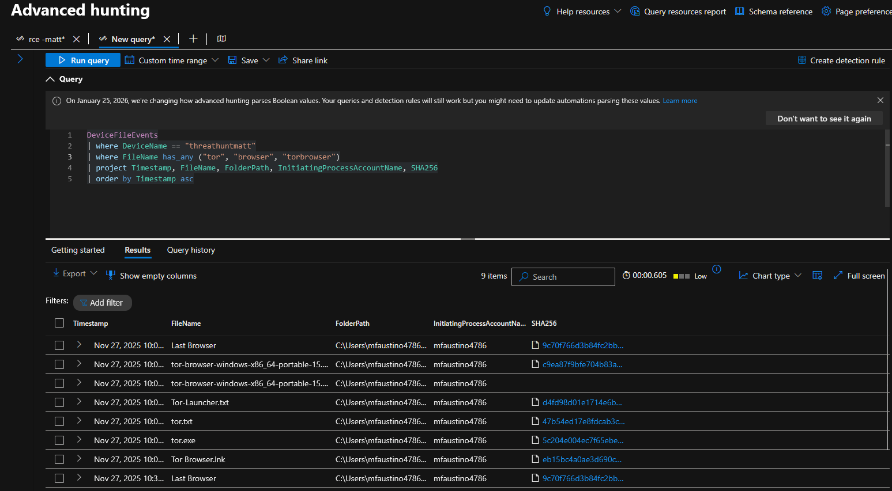
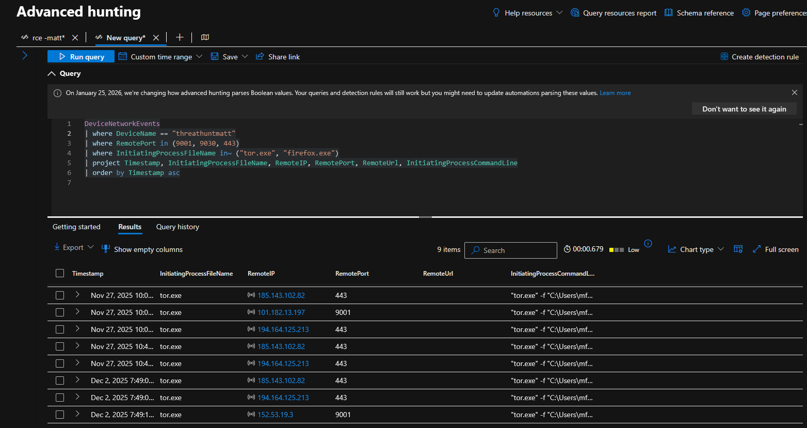
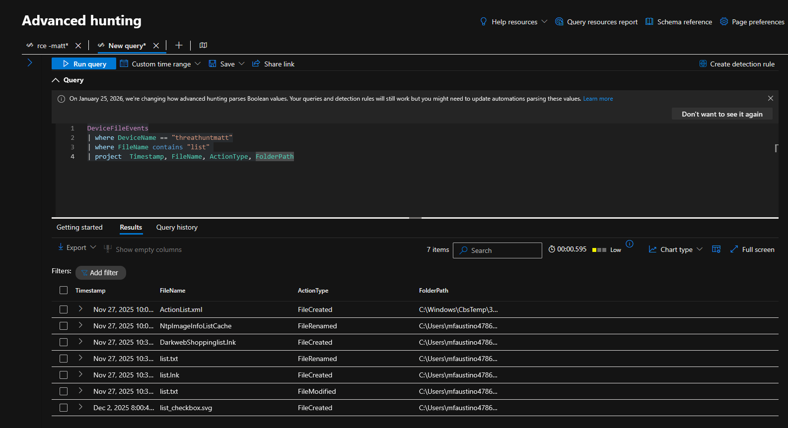

# KQL Queries Used for Hunting TOR Traffic


## 🔍 Process Activity


```kql
DeviceProcessEvents
| where DeviceName == "threathuntmatt"
| where ProcessCommandLine has_any ("tor.exe", "Tor Browser", "torbrowser", "Browser\\firefox.exe")
    or FileName in~ ("tor.exe", "firefox.exe")
| project Timestamp, FileName, FolderPath, ProcessCommandLine, InitiatingProcessAccountName, SHA256
| order by Timestamp asc

```




## 📁 File Activity


```kql
DeviceFileEvents
| where DeviceName == "threathuntmatt"
| where FileName has_any ("tor", "browser", "torbrowser")
| project Timestamp, FileName, FolderPath, InitiatingProcessAccountName, SHA256
| order by Timestamp asc

```



## 🌐 Network Activity


```kql
DeviceNetworkEvents
| where DeviceName == "azuki-sl"
| where RemotePort in (9001, 9030, 443)
| where InitiatingProcessFileName in~ ("tor.exe", "firefox.exe")
| project Timestamp, InitiatingProcessFileName, RemoteIP, RemotePort, RemoteUrl, InitiatingProcessCommandLine
| order by Timestamp asc
```


```kql
DeviceFileEvents
| where DeviceName == "threathuntmatt"
| where FileName contains "list"
| project Timestamp, FileName, ActionType, FolderPath

```


